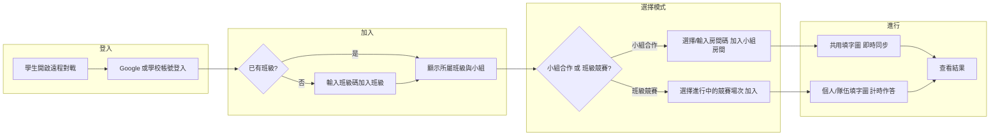
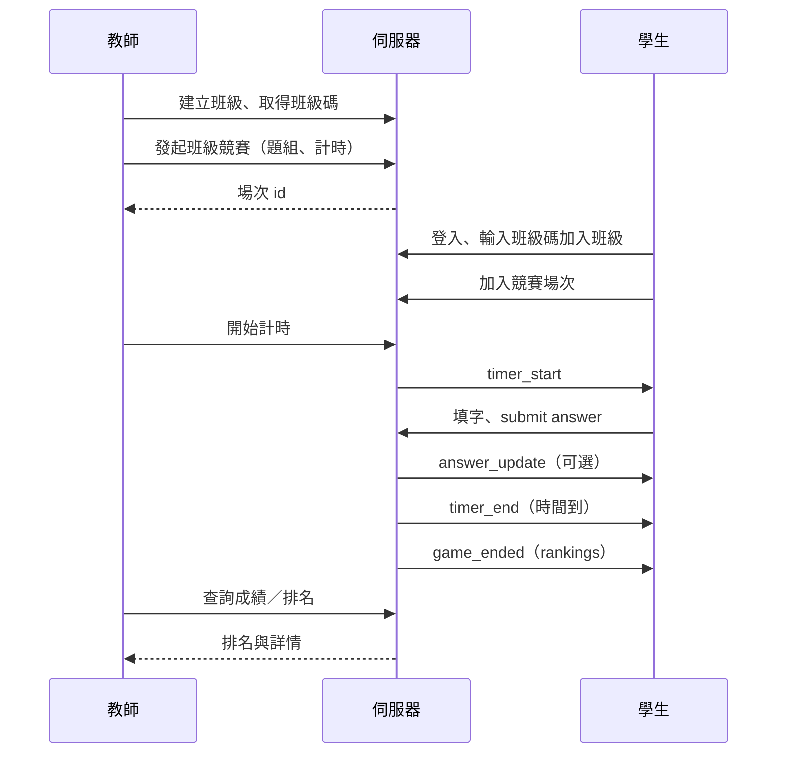

# 中文填字接龍 — 遠程對戰說明書

本說明書定義「遠程對戰」的兩種模式（小組合作、班級競賽）、分組與班級碼機制、教師端與學生端流程、資料模型、即時同步、計時與勝負規則，以及安全與注意事項。實作時可依此規格擴充後端 API、WebSocket 與前端畫面。

---

## 一、概述與目標

### 1.1 遠程對戰定位

遠程對戰讓學生在**不同裝置**上透過網路參與填字活動，分為：

- **小組合作**：同一小組成員**共用一張填字圖**，多人同時在同一網格上操作，即時協作完成題目。
- **班級競賽**：全班（或跨組）學生**各自作答同一題組**，在相同時間內比「填字正確數量」與完成時間，個人或隊伍排名。

兩者皆需學生**登入帳號**，並透過**班級碼**或**分組**加入對應場次；教師可建立班級、分組、題組，發起活動並即時查看進度與計時。

### 1.2 與其他模式的差異

| 模式       | 裝置         | 填字圖         | 主要用途           |
| ---------- | ------------ | -------------- | ------------------ |
| 練習模式   | 單機         | 一人一圖       | 自習、熟悉題型     |
| 本地對戰   | 同機雙人     | 一機一圖、輪流/分色 | 面對面競技         |
| 遠程—小組合作 | 多人多機     | **共用一圖**   | 小組協作、討論作答 |
| 遠程—班級競賽 | 多人多機     | **每人/每組一圖** | 全班競賽、計時排名 |

### 1.3 適用情境

- **小組合作**：分組討論、共學，同一組看到同一張圖並同時填格，教師可觀察各組進度。
- **班級競賽**：測驗、複習競賽，全班同時開始、計時結束，以正確數與時間排名。

---

## 二、名詞與角色

| 名詞       | 說明 |
| ---------- | ---- |
| **教師**   | 建立班級、小組、題組，發起「小組合作」或「班級競賽」場次，可查看學生操作進度與計時、結算成績。 |
| **學生**   | 登入後可依班級碼加入班級、自動歸入教師預設之小組，加入房間/場次後進行填字（小組共用一圖或個人一圖）。 |
| **班級**   | 由教師建立，擁有唯一**班級碼**；學生輸入班級碼後加入該班，可參與該班下的競賽場次。 |
| **小組**   | 隸屬於班級，由教師預先建立並**綁定學生帳號**（如 email 或使用者 ID）；學生登入後自動顯示所屬小組，用於「小組合作」時共用一張填字圖。 |
| **房間 / 場次** | **小組合作**時：一間房間對應一組題、一小組成員，共用一圖。**班級競賽**時：一場次對應一組題、一計時區間，每人/每隊獨立一圖，時間到統一結算。 |
| **班級碼** | 教師建立班級後取得，學生輸入後加入該班級（用於加入班級與班級競賽）。 |
| **房間碼** | 建立「小組合作」房間或「班級競賽」場次後產生，用於學生加入特定房間/場次（可與班級碼並存：先有班級，再透過班級內場次或房間碼進入）。 |

### 2.1 學生電郵格式

本系統學生帳號採用學校提供之電郵，格式為：

- **`xxxxxxx@student.isf.edu.hk`**

其中 `xxxxxxx` 為校方分配之帳號部分。教師在後台建立小組、綁定學生時，應貼上或匯入此格式之電郵；後端可依此格式驗證學生身分、限制僅學生可加入班級／小組。登入後系統可依電郵網域辨識為學生帳號並顯示所屬班級與小組。

---

## 三、小組合作模式

### 3.1 行為說明

- **共用填字圖**：同一小組成員看到**同一題組、同一網格**；任一人在某格填寫或修改後，經由伺服器即時同步給同組所有人。
- **同時操作**：多人可同時在不同格子輸入；若同一格被多人同時改寫，需有明確**衝突策略**（見第八章）。
- **分組來源**：小組由教師在後台建立，並將學生帳號（email 或系統使用者 ID）貼上或選擇後綁定至各小組；學生登入後無需再選組，系統依帳號顯示所屬班級與小組。

### 3.2 加入流程

1. 教師建立班級與小組，並將學生帳號綁定到各小組。
2. 教師發起「小組合作」，選擇題組並建立房間（或指定既有房間）；可選擇要開放的小組或產生房間碼。
3. 學生登入後，在「遠程對戰」中選擇「小組合作」，系統顯示其所屬小組及該小組的進行中房間（若有）；或學生輸入**房間碼**加入指定房間。
4. 僅**該小組成員**可加入該小組的房間；加入後進入共用填字畫面。

### 3.3 教師端

- **操作進度**：教師可即時看到各小組房間的填字狀態，例如：已填格數、正確格數、即時網格畫面或統計。
- **計時**：教師可開始/結束計時；開始後學生端顯示倒數或經過時間，結束後可鎖定作答並顯示結果（若規格有設計）。

---

## 四、班級競賽模式

### 4.1 行為說明

- **班級碼**：教師建立班級後取得一組班級碼（或含班級碼的連結）；學生登入後輸入班級碼即可加入該班級，並可參加該班級下的競賽場次。
- **同一時間開戰**：教師發起一場「班級競賽」，選擇題組、設定計時（例如 5 分鐘）；學生加入該場次後，由教師或系統在到齊或倒數後**同時開始**，所有人看到同一題組但**各自一份填字圖**（或每隊一份，依規則）。
- **計時**：整場有開始與結束時間；以**伺服器時間**為準，時間到自動結束並結算，不允許學生端延長或改時間。

### 4.2 勝負規則

- 在**同一計時區間內**，以**填字正確數量**多者為勝。
- 可支援**個人排名**（每人一圖、比個人正確數）或**隊伍/小組排名**（每隊一圖或組內加總正確數）。
- 正確數相同時，可依**完成時間**（最後一格正確填寫的時間）或並列處理，依產品需求訂定。

### 4.3 加入流程

1. 教師建立班級，取得班級碼並分享給學生。
2. 教師發起「班級競賽」，選擇題組、設定計時與是否顯示提示，建立場次。
3. 學生登入後輸入**班級碼**加入班級，在班級內看到進行中或即將開始的競賽場次並加入。
4. 教師（或系統）開始計時後，所有已加入的學生同時開始作答；時間到自動收卷並顯示排名。

---

## 五、教師端功能

### 5.1 班級與小組管理

- **班級**：建立班級、取得/重設班級碼、檢視已加入學生名單。
- **小組**：在班級下建立多個小組，將學生帳號綁定到各小組。學生帳號格式為 **`xxxxxxx@student.isf.edu.hk`**，教師可從名單選擇或貼上此格式電郵；支援匯入名單（如 CSV）以批次綁定。

### 5.2 題組與活動發起

- **題組**：使用既有題組（與練習/本地對戰共用題組來源），選擇要用于小組合作或班級競賽的題組。
- **發起小組合作**：選擇題組、選擇目標小組或產生房間碼，建立房間；可選計時（開始/結束）。
- **發起班級競賽**：選擇題組、設定計時長度與提示開關，建立場次；學生透過班級碼加入班級後加入該場次。

### 5.3 即時進度與計時

- **操作進度**：即時或近即時查看各房間/場次的已填格數、正確數；可選是否看到每格對錯或僅統計。
- **計時**：開始、結束由教師或後端觸發；學生端與教師端顯示一致之倒數或經過時間（以伺服器為準）。

### 5.4 結算與成績

- 場次結束後，教師可查看排名、每人/每隊正確數與完成時間，並可匯出或留存供教學分析。

---

## 六、學生端流程

### 6.1 步驟摘要

1. **登入**：使用 Google 或學校帳號登入。
2. **班級**：若尚未加入班級，輸入班級碼加入；登入後系統顯示所屬班級與小組（由教師預設綁定）。
3. **模式**：選擇「小組合作」或「班級競賽」。
4. **加入**：小組合作 — 選擇所屬小組的進行中房間或輸入房間碼；班級競賽 — 在班級內選擇一場競賽並加入。
5. **進行**：小組合作時在共用圖上與組員即時協作；班級競賽時在個人/隊伍圖上計時作答。
6. **結果**：時間到或教師結束後，查看排名與正確數。

---

## 七、資料模型與 API 概念

### 7.1 實體關係（概念）

- **班級 (Class)**：id, 名稱, 班級碼, 教師 id, 建立時間。
- **小組 (Group)**：id, 班級 id, 名稱, 成員（使用者 id 或 email 清單）。
- **使用者 (User)**：id, email, 顯示名稱, 頭像（選用）；與班級/小組的關聯為「加入班級」「隸屬小組」。
- **場次/房間 (Session / Room)**：
  - 小組合作：房間 id, 題組 id, 班級 id, 小組 id, 狀態（等待中/進行中/已結束）, 建立時間；一房間對應一小組、一題組、一張共用答案狀態。
  - 班級競賽：場次 id, 題組 id, 班級 id, 狀態, 計時設定（開始/結束時間或時長）, 參與者（每人或每隊一組答案）。
- **題組 (PuzzleSet)**：與現有前端題組一致，id, 標題, 類型（crossword）, 題目內容（如 crossword JSON）。
- **答案狀態**：
  - 小組合作：房間 id → 一張網格答案（cellKey → value），以及可選的 filledBy（userId）用於顯示誰填的。
  - 班級競賽：場次 id + 參與者 id（或隊伍 id）→ 每份獨立網格答案。

### 7.2 REST API 概念（建議）

- `POST /api/classes` — 教師建立班級（回傳班級碼）。
- `GET /api/classes/:code` — 依班級碼查班級資訊（學生加入時驗證）。
- `POST /api/classes/:id/join` — 學生以班級碼加入班級。
- `POST /api/classes/:classId/groups` — 教師建立小組；`PUT .../groups/:groupId` — 更新小組成員（貼上帳號清單）。
- `GET /api/classes/:classId/groups` — 列出班級下小組。
- `GET /api/me/class-and-groups` — 登入者所屬班級與小組（學生端用）。
- `POST /api/rooms` — 建立房間（小組合作：題組 id、小組 id；可選班級 id）。
- `GET /api/rooms/:id` — 取得房間資訊與題組、當前答案狀態（重連/全量同步用）。
- `POST /api/sessions` — 建立班級競賽場次（題組 id、班級 id、計時設定）。
- `GET /api/sessions/:id` — 取得場次資訊、題組、參與者名單與成績。
- `POST /api/sessions/:id/join` — 學生加入競賽場次。

（實際路徑與權限依後端實作為準；以上為概念列舉。）

### 7.3 WebSocket 事件概念（與現有前端對齊並擴充）

- **連線**：`/ws/room/:roomId` 或 `/ws/session/:sessionId`，query 帶 userId、displayName；可選 role=teacher。
- **現有**：`player_joined`、`player_left`（members 名單）、`game_started`（puzzleId）、`answer_update`（scores）、`player_finished`、`game_ended`（scores、rankings）。
- **擴充建議**：
  - **小組合作**：`cell_fill`（cellKey, value, userId, correct）— 某人填格後廣播給同房；`sync_state` — 重連時全量推送題組 + 整張答案。
  - **計時**：`timer_start`（endAt 或 duration）、`timer_end` — 以伺服器時間為準。
  - **教師**：`progress_update`（已填數、正確數、可選每格狀態）供教師端即時看。

---

## 八、即時同步與衝突

### 8.1 事件格式建議（小組合作）

- **填格**：客戶端送出 `{ type: "cell_fill", cellKey: "r,c", value: "字" }`；伺服器驗證後廣播給同房所有人（可帶 userId、correct）。
- **全量同步**：重連或剛進房時，伺服器推送 `{ type: "sync_state", puzzle: {...}, answers: { cellKey: value }, ... }`，客戶端以之覆蓋本地狀態。

### 8.2 衝突策略

- **同一格多人同時改寫**：建議採用 **last-write-wins**（後寫覆蓋），並以伺服器收到之順序為準；或由伺服器對同一 cellKey 做排隊，只接受先到者，後到者收到 reject 或 overwrite 通知。
- **可選**：前端在 focus 某格時可先送「鎖格」意圖，減少同時寫同一格（實作複雜度較高，可列為進階）。

### 8.3 離線與重連

- 斷線後重連：客戶端重新連上同一房間/場次，伺服器應送 `sync_state`（題組 + 當前整張答案 + 計時狀態），避免畫面與他人不一致。
- 班級競賽：每人獨立答案，無需與他人同步格子，僅需同步「開始/結束」與計時；重連時補發題組與本人答案狀態即可。

---

## 九、計時與勝負規則

### 9.1 計時

- **權威來源**：以**伺服器時間**為準；開始、結束由伺服器廣播（或教師觸發後由伺服器執行）。
- **顯示**：學生端與教師端顯示剩餘時間或經過時間，由伺服器定期推送或客戶端依開始時間與時長推算（需與伺服器對時一次）。

### 9.2 勝負

- **班級競賽**：在計時區間內，依**正確填字數量**排名；正確數相同時可依**最後正確填寫時間**或並列。
- **小組合作**：若僅作協作不排名，可無勝負；若有「完成時間」統計，可以整組完成時間或正確數為準。

### 9.3 結算

- 時間到或教師結束時，伺服器鎖定答案、計算每人/每隊正確數與時間，推送 `game_ended`（含 rankings）；前端顯示排名與可選的詳情。

---

## 十、安全、效能與注意事項

### 10.1 權限與身分

- 僅**教師**可建立班級、小組、發起房間/場次；學生不可建立班級或修改他人小組。
- 僅**該班學生**可依班級碼加入該班；僅**該小組成員**可加入該小組的合作房間。
- 敏感操作（開局、結算、計時結束）由**後端或教師**觸發，學生端不可自改成績或延長時間。

### 10.2 防作弊

- 不提前洩題：題目在「開始」後才下發或解鎖。
- 成績與答案以伺服器為準，學生端不可上傳任意分數。
- 計時以伺服器為準，避免客戶端改系統時間作弊。

### 10.3 可擴展性

- 單一房間/場次人數上限（例如 4～8 人小組、30～50 人班級），避免單一 WebSocket 廣播過多連線。
- 廣播頻率可節流（例如同一格 100ms 內只廣播最後一次），減少頻寬與前端更新負擔。

### 10.4 隱私與合規

- 學生資料（帳號、成績）僅供該班教師與該班活動使用，不對外開放。
- 依校園或地區資料保護規範處理個人資料儲存與存取。

### 10.5 市面常見注意事項彙整

- **即時同步**：WebSocket 或 SSE，延遲與順序（last-write-wins 或 OT/CRDT）需明確定義。
- **衝突處理**：同一格同時改寫之策略需一致並在說明書/API 中寫清。
- **離線/重連**：補發題組與全量答案狀態，避免畫面不一致。
- **計時一致性**：伺服器時間為準，開始/結束由伺服器廣播。
- **可擴展性**：人數上限、連線數、廣播節流。

---

## 十一、與現有前端的對應

### 11.1 現有實作摘要

- **RemoteBattle.vue**：登入（Google）、建立房間（選題組、POST /api/rooms）、加入房間（輸入房間碼）、房間內成員列表、開始對戰（start_game）、離開房間；顯示 scores、rankings（game_ended 時）。
- **remoteGame.ts**：`RemoteRoom`（id, puzzleId, status, members）、scores、rankings；WebSocket 處理 `player_joined`、`player_left`、`game_started`、`answer_update`、`player_finished`、`game_ended`；`joinRoom(roomId, userId, displayName)`、`startGame(puzzleId)`、`submitAnswer(cellKey, value, correct)`、`finishGame()`。
- **api.ts**：`getApiUrl()`、`setApiUrl()`、JWT/User 儲存、`connectWebSocket(roomId, userId, displayName)`。

### 11.2 擴充建議（不修改程式，僅規格對應）

- **班級碼**：學生端新增「輸入班級碼加入班級」流程；呼叫 `POST /api/classes/:code/join` 或等同 API；登入後可讀取 `GET /api/me/class-and-groups` 顯示所屬班級與小組。
- **小組**：教師端新增班級與小組管理頁（建立小組、貼上/選擇學生帳號綁定）；學生端在「小組合作」入口顯示所屬小組與可加入的房間。
- **房間/場次區分**：前端可區分「小組合作房間」與「班級競賽場次」兩種入口；WebSocket 連線路徑或參數區分 room vs session。
- **共用填字圖狀態**：小組合作時，remoteGame 需能接收並儲存**整張網格答案**（例如 `sharedAnswers: Record<cellKey, value>`）與可選 `filledBy`；收到 `cell_fill` 或 `sync_state` 時更新並驅動共用填字畫面（可新增元件或擴充現有 CrosswordPlay 為「遠程共用」模式）。
- **教師端**：新增教師專用路由與頁面（班級/小組管理、發起小組合作或班級競賽、即時進度與計時、結算）；教師連線 WebSocket 時可帶 role=teacher，接收 `progress_update` 等事件。
- **計時**：前端訂閱 `timer_start`、`timer_end`，在畫面顯示倒數或經過時間；開始/結束由後端或教師觸發，不依客戶端本地時間決定勝負。

以上擴充點可作為後續實作清單，與本說明書第七、八、九章規格對齊。

---

## 十二、附錄

### 12.1 WebSocket 訊息一覽（建議）

| 方向   | type            | 說明 |
| ------ | --------------- | ---- |
| 伺服器→客戶端 | player_joined   | 有人加入，附 members |
| 伺服器→客戶端 | player_left     | 有人離開，附 members |
| 伺服器→客戶端 | game_started   | 遊戲開始，附 puzzleId |
| 伺服器→客戶端 | cell_fill       | （小組合作）某格被填寫，附 cellKey, value, userId, correct |
| 伺服器→客戶端 | sync_state      | 全量同步題組與答案（重連/進房） |
| 伺服器→客戶端 | answer_update  | 分數更新，附 scores |
| 伺服器→客戶端 | player_finished | 有人交卷，附 scores |
| 伺服器→客戶端 | game_ended      | 場次結束，附 scores, rankings |
| 伺服器→客戶端 | timer_start     | 計時開始，附 endAt 或 duration |
| 伺服器→客戶端 | timer_end       | 計時結束 |
| 伺服器→客戶端 | progress_update | （教師端）進度摘要 |
| 客戶端→伺服器 | start_game      | 開始遊戲，附 puzzleId |
| 客戶端→伺服器 | answer          | 送出單格答案，附 cellKey, value, correct |
| 客戶端→伺服器 | cell_fill       | （小組合作）填格，附 cellKey, value |
| 客戶端→伺服器 | finish          | 本人交卷 |

### 12.2 錯誤碼／狀態碼建議

- `ROOM_FULL` — 房間已滿。
- `NOT_IN_GROUP` — 非該小組成員，無法加入該小組房間。
- `CLASS_CODE_INVALID` — 班級碼錯誤或已失效。
- `SESSION_ENDED` — 場次已結束，無法加入或提交。
- `UNAUTHORIZED` — 未登入或權限不足。
- `PUZZLE_NOT_FOUND` — 題組不存在或無權存取。

（實際代碼與 HTTP/WebSocket 對應依後端實作為準。）

### 12.3 流程圖：班級競賽從發起到結算

---

*本說明書為規格與設計文件，實作時請依後端與前端技術棧調整 API 路徑、訊息格式與錯誤碼；與現有 `RemoteBattle.vue`、`remoteGame.ts` 的對應與擴充建議見第十一章。*
