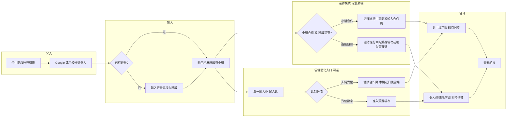
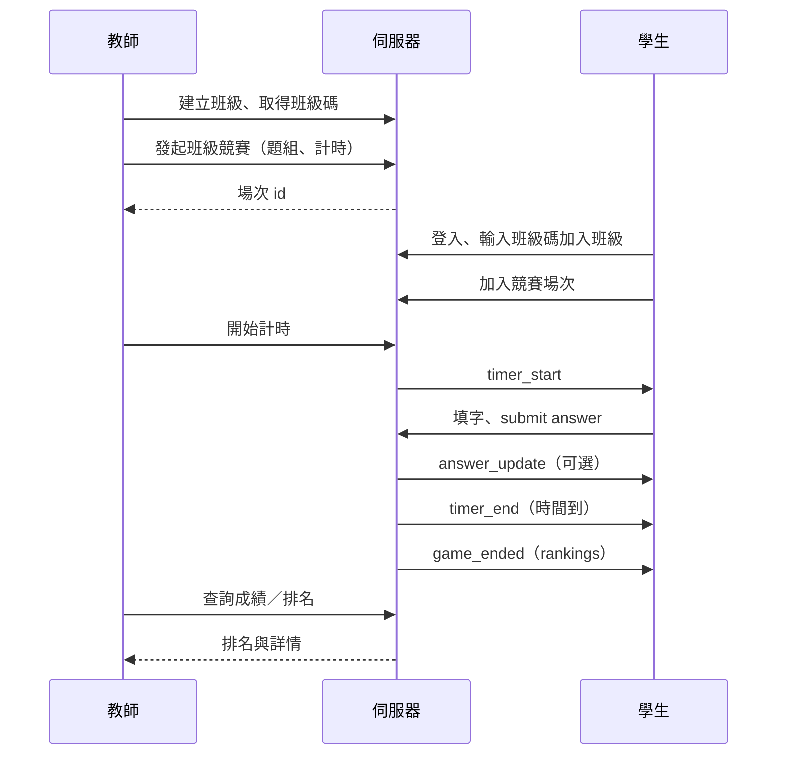

# 中文填字接龍 — 遠程對戰說明書

本說明書定義「遠程對戰」的兩種模式（小組合作、班級競賽）、分組與班級碼機制、教師端與學生端流程、資料模型、即時同步、計時與勝負規則，以及安全與注意事項。實作時可依此規格擴充後端 API、WebSocket 與前端畫面。

---

## 一、概述與目標

### 1.1 遠程對戰定位

遠程對戰讓學生在**不同裝置**上透過網路參與填字活動，分為：

- **小組合作**：同一小組成員**共用一張填字圖**，多人同時在同一網格上操作，即時協作完成題目。
- **班級競賽**：全班（或跨組）學生**各自作答同一題組**，在相同時間內比「填字正確數量」與完成時間，個人或隊伍排名。

兩者皆需學生**登入帳號**；在雲端簡化入口下，學生可於「遠程對戰」頁**單一輸入框**輸入碼，由系統依**碼制**自動分流至競賽場次或（未來）合作房間；亦可透過**班級碼**加入班級後從列表進入。教師可建立班級、分組、題組，發起活動並即時查看進度與計時。

### 1.2 與其他模式的差異

| 模式       | 裝置         | 填字圖         | 主要用途           |
| ---------- | ------------ | -------------- | ------------------ |
| 練習模式   | 單機         | 一人一圖       | 自習、熟悉題型     |
| 本地對戰   | 同機雙人     | 一機一圖、輪流/分色 | 面對面競技         |
| 遠程—小組合作 | 多人多機     | **共用一圖**   | 小組協作、討論作答 |
| 遠程—班級競賽 | 多人多機     | **每人/每組一圖** | 全班競賽、計時排名 |

### 1.3 適用情境

- **小組合作**：分組討論、共學，同一組看到同一張圖並同時填格，教師可觀察各組進度。
- **班級競賽**：測驗、複習競賽，全班同時開始、計時結束，以正確數與時間排名。

### 1.4 兩種模式分支總覽

遠程對戰在產品上拆為兩條**分支**，後端資料與同步方式不同；學生端可共用同一「遠程對戰」入口，但須以**碼制 + 文案**區分，避免與後台「房間／場次」等技術名詞混談。

| 分支 | 名稱 | 學生心智 | 資料核心 | 雲端實作現況（參第十三章） |
|------|------|----------|----------|---------------------------|
| **分支甲** | 班級競賽（計時對戰） | 自己一張圖、計時比排名 | 一場次、每人獨立答案 | Cloudflare 已支援（D1 + REST，`/api/sessions`、六位**競賽碼**） |
| **分支乙** | 小組合作（共用一圖） | 與組員同畫面、一起填 | 一房間、**一份**共用答案 | 本機 Express + WebSocket 已支援；正式站尚缺 `/api/rooms` 與同步層 |

後續第三章為分支乙之**行為規格**，第四章為分支甲；第十三章為分支乙之**雲端實施與演進路線**（由原《小組合作功能實施計劃》併入）。

---

## 二、名詞與角色

| 名詞       | 說明 |
| ---------- | ---- |
| **教師**   | 建立班級、小組、題組，發起「小組合作」或「班級競賽」場次，可查看學生操作進度與計時、結算成績。 |
| **學生**   | 登入後可依班級碼加入班級、自動歸入教師預設之小組，以**競賽碼**或**合作碼**加入場次／房間後進行填字（小組共用一圖或個人一圖）。 |
| **班級**   | 由教師建立，擁有唯一**班級碼**；學生輸入班級碼後加入該班，可參與該班下的競賽場次。 |
| **小組**   | 隸屬於班級，由教師預先建立並**綁定學生帳號**（如 email 或使用者 ID）；學生登入後自動顯示所屬小組，用於「小組合作」時共用一張填字圖。 |
| **房間 / 場次** | **小組合作**時：一間房間對應一組題、一小組成員，共用一圖。**班級競賽**時：一場次對應一組題、一計時區間，每人/每隊獨立一圖，時間到統一結算。 |
| **班級碼** | 教師建立班級後取得，學生輸入後加入該班級（用於加入班級與班級內列表；與單次活動的競賽碼／合作碼不同）。 |
| **競賽碼**（**場次碼**） | 用於**分支甲（班級競賽）**。建議學生端顯示「競賽碼」或「場次碼」；格式為**恰好 6 位數字**（與現行 `RemoteBattle.vue` 分流邏輯一致：純六位 → 走競賽場次 API）。 |
| **合作碼**（**小組碼**） | 用於**分支乙（小組合作）**。建議學生端顯示「合作碼」或「小組碼」；格式須**不得**為純六位數字，以免與競賽碼誤判（例如 8 位英數大寫、或 `G-` 前綴 + 短碼，實作以後端為準）。 |
| **「房間碼」（舊稱）** | 歷史統稱，易與競賽混淆。**文件與 UI 建議停用**；請改用**競賽碼**／**合作碼**之一。 |

### 2.1 統一碼制與用語（規範）

| 模式 | 建議學生可見文案 | 碼格式（建議） | 學生一句話 |
|------|------------------|----------------|------------|
| 班級競賽 | 競賽碼／場次碼 | 恰好 6 位數字 | 「計時、自己答、比排名」 |
| 小組合作 | 合作碼／小組碼 | 非純六位（英數組合或帶前綴） | 「跟組員同一張圖一起填」 |

- **禁止**兩種活動在投影或口頭上都只說「房間碼」；教師發碼時應唸出模式名稱（「今天的**競賽碼**是…」「這組的**合作碼**是…」）。
- 前端實作對應：`src/views/play/RemoteBattle.vue` 已採「六位數 → 競賽；其餘字串 → 嘗試合作房間（本機／日後雲端）」；雲端上線合作房時，**合作碼**必須遵守非純六位規則。

### 2.2 學生電郵格式

本系統學生帳號採用學校提供之電郵，格式為：

- **`xxxxxxx@student.isf.edu.hk`**

其中 `xxxxxxx` 為校方分配之帳號部分。教師在後台建立小組、綁定學生時，應貼上或匯入此格式之電郵；後端可依此格式驗證學生身分、限制僅學生可加入班級／小組。登入後系統可依電郵網域辨識為學生帳號並顯示所屬班級與小組。

---

## 三、小組合作模式

### 3.1 行為說明

- **共用填字圖**：同一小組成員看到**同一題組、同一網格**；任一人在某格填寫或修改後，經由伺服器即時同步給同組所有人。
- **同時操作**：多人可同時在不同格子輸入；若同一格被多人同時改寫，需有明確**衝突策略**（見第八章）。
- **分組來源**：小組由教師在後台建立，並將學生帳號（email 或系統使用者 ID）貼上或選擇後綁定至各小組；學生登入後無需再選組，系統依帳號顯示所屬班級與小組。

### 3.2 加入流程

1. 教師建立班級與小組，並將學生帳號綁定到各小組。
2. 教師發起「小組合作」，選擇題組並建立房間（或指定既有房間）；可選擇要開放的小組或產生房間碼。
3. 學生登入後，在「遠程對戰」中選擇「小組合作」，系統顯示其所屬小組及該小組的進行中房間（若有）；或學生輸入**合作碼**加入指定房間（勿與六位**競賽碼**混用）。
4. 僅**該小組成員**可加入該小組的房間；加入後進入共用填字畫面。

### 3.3 教師端

- **操作進度**：教師可即時看到各小組房間的填字狀態，例如：已填格數、正確格數、即時網格畫面或統計。
- **計時**：教師可開始/結束計時；開始後學生端顯示倒數或經過時間，結束後可鎖定作答並顯示結果（若規格有設計）。

---

## 四、班級競賽模式

### 4.1 行為說明

- **班級碼**：教師建立班級後取得一組班級碼（或含班級碼的連結）；學生登入後輸入班級碼即可加入該班級，並可參加該班級下的競賽場次。
- **同一時間開戰**：教師發起一場「班級競賽」，選擇題組、設定計時（例如 5 分鐘）；學生加入該場次後，由教師或系統在到齊或倒數後**同時開始**，所有人看到同一題組但**各自一份填字圖**（或每隊一份，依規則）。
- **計時**：整場有開始與結束時間；以**伺服器時間**為準，時間到自動結束並結算，不允許學生端延長或改時間。

### 4.2 勝負規則

- 在**同一計時區間內**，以**填字正確數量**多者為勝。
- 可支援**個人排名**（每人一圖、比個人正確數）或**隊伍/小組排名**（每隊一圖或組內加總正確數）。
- 正確數相同時，可依**完成時間**（最後一格正確填寫的時間）或並列處理，依產品需求訂定。

### 4.3 加入流程

1. 教師建立班級，取得班級碼並分享給學生。
2. 教師發起「班級競賽」，選擇題組、設定計時與是否顯示提示，建立場次。
3. 學生登入後輸入**班級碼**加入班級，在班級內看到進行中或即將開始的競賽場次並加入。
4. 教師（或系統）開始計時後，所有已加入的學生同時開始作答；時間到自動收卷並顯示排名。

### 4.4 計分單位、排名與加分政策（分支甲詳述）

本節專指**班級競賽（分支甲）**；小組合作之計分語意見 §9.2 與下表對照。

| 項目 | 班級競賽（分支甲） | 小組合作（分支乙） |
|------|-------------------|-------------------|
| **計分單位** | 每人（或每隊）**獨立**一份答案格 | 全組**一份** `sharedAnswers` |
| **「分數」定義** | 與題組一致之**正確格數**（可另加完成度百分比為輔助指標） | 預設**不排名**；若要比較，建議以**全組正確格總數**或教師按「開始／結束」之**全組完成耗時** |
| **排名規則** | **先比正確數**，同分比**用時**（與現行 Cloudflare 實作一致處應於後端註明版本） | 預設無個人排名；若活動需要「組間對抗」，應採**多房間各代表一組**，再比各房之**組總正確數／完成時間**——與「同一房多人共編、對組員個人排名」語意區隔 |
| **加分** | 若產品要額外「加分」，須單獨列規格：**連續答對獎勵／時間獎勵／提示扣分**等是否採用 | 同上政策若套用，須另定規格；**預設建議不加額外加分項** |

**預設產品建議（分支甲）**：僅採「**正確格數 + 時間**」作為排名依據，**不**預設連續答對獎、速度加成等，以降低爭議與作弊誘因。若日後啟用加分，須寫入 API 與教師說明並可稽核。

**與小組合作之區隔**：**不在同一合作房間內**對組員做**個人排名**（除非另定規格並改資料模型）。

---

## 五、教師端功能

### 5.1 班級與小組管理

- **班級**：建立班級、取得/重設班級碼、檢視已加入學生名單。
- **小組**：在班級下建立多個小組，將學生帳號綁定到各小組。學生帳號格式為 **`xxxxxxx@student.isf.edu.hk`**，教師可從名單選擇或貼上此格式電郵；支援匯入名單（如 CSV）以批次綁定。

### 5.2 題組與活動發起

- **題組**：使用既有題組（與練習/本地對戰共用題組來源），選擇要用于小組合作或班級競賽的題組。
- **發起小組合作**：選擇題組、選擇目標小組或產生**合作碼**，建立房間；可選計時（開始/結束）。
- **發起班級競賽**：選擇題組、設定計時長度與提示開關，建立場次；學生透過班級碼加入班級後加入該場次。

### 5.3 即時進度與計時

- **操作進度**：即時或近即時查看各房間/場次的已填格數、正確數；可選是否看到每格對錯或僅統計。
- **計時**：開始、結束由教師或後端觸發；學生端與教師端顯示一致之倒數或經過時間（以伺服器為準）。

### 5.4 結算與成績

- 場次結束後，教師可查看排名、每人/每隊正確數與完成時間，並可匯出或留存供教學分析。

### 5.5 教師一鍵情境（建議日常工作流）

依課型選最短路徑，並搭配 §2.1 **碼制**避免學生混淆：

1. **僅競賽課**  
   - 教師後台「發起競賽」→ 複製**六位數競賽碼**→ 口頭或投影給學生。  
   - 請對學生統一說法：「**六位數 = 計時比賽**」。

2. **僅合作課**  
   - 教師「選題組 → 建立合作房間」→ 複製**合作碼**→ 只給該組學生。  
   - 小組名單：**Phase 1** 可選填（開放碼 + 登入即可嘗試進房）；**Phase 2** 可改為必綁名單（僅名單內學生可進），詳第十三章。

3. **混合課**  
   - 開課先講清：「今天有**兩個碼**——一個是**比賽**、一個是**分組一起做**。」  
   - 投影時用**不同標題或顏色**區隔（例如左欄「競賽碼」、右欄「合作碼」），且合作碼**不得**長得像六位純數字。

### 5.6 教師端與學生端對照與權限矩陣

**能力對照（簡表）**

| 能力 | 教師 | 學生 |
|------|------|------|
| 建立／維護班級、小組、題組 | ✓ | ✗ |
| **發起**活動（競賽場次／合作房間） | ✓ | ✗ |
| **開始／結束**計時與場次 | ✓ | ✗（由伺服器或教師權威觸發） |
| 發放**競賽碼**／**合作碼** | ✓（或由系統產碼後由教師轉述） | ✗ |
| 登入後輸入碼或從列表進入 | ✓（若教師示範） | ✓ |
| 在權限內作答／協作填格 | ✓（示範） | ✓ |
| 查看**全班／全組**進度與結算 | ✓ | 依產品：通常僅本人或小組內可見明細 |
| 竄改他人班級、小組或他人答案 | ✗ | ✗ |
| 自行延長計時、改寫伺服端成績 | ✗ | ✗ |

**權限矩陣（精簡）**

| 動作 | 誰可執行 | 備註 |
|------|----------|------|
| 建立房間／場次 | 教師 | 呼應 §10.1 |
| 加入競賽／合作房 | 已登入學生（+ 可選名單驗證） | 合作碼 Phase 1 可僅驗碼；Phase 2 驗證 email ∈ 小組 |
| 查看他人每格對錯明細 | 預設教師可監看；學生端依隱私設計可能僅統計或不可見他人明細 | 與 §10.4 合規並列考量 |

---

## 六、學生端流程

### 6.1 步驟摘要

1. **登入**：使用 Google 或學校帳號登入。
2. **班級**：若尚未加入班級，輸入班級碼加入；登入後系統顯示所屬班級與小組（由教師預設綁定）。
3. **雲端簡化入口（與 §1.1 一致）**：登入後可在遠程對戰頁使用**單一輸入框**，依**碼制**自動分流——**六位數字 → 競賽場次**；**非純六位 → 合作房**（合作雲端上線後啟用完整路徑）。
4. **模式**（完整 UI）：選擇「小組合作」或「班級競賽」。
5. **加入**：小組合作 — 選擇所屬小組的進行中房間或輸入**合作碼**；班級競賽 — 在班級內選擇一場競賽並加入，或輸入**競賽碼**。
6. **進行**：小組合作時在共用圖上與組員即時協作；班級競賽時在個人/隊伍圖上計時作答。
7. **結果**：時間到或教師結束後；競賽看排名與正確數，合作預設以協作完成為主（見 §9）。

---

## 七、資料模型與 API 概念

### 7.1 實體關係（概念）

- **班級 (Class)**：id, 名稱, 班級碼, 教師 id, 建立時間。
- **小組 (Group)**：id, 班級 id, 名稱, 成員（使用者 id 或 email 清單）。
- **使用者 (User)**：id, email, 顯示名稱, 頭像（選用）；與班級/小組的關聯為「加入班級」「隸屬小組」。
- **場次/房間 (Session / Room)**：
  - 小組合作：房間 id, 題組 id, 班級 id, 小組 id, 狀態（等待中/進行中/已結束）, 建立時間；一房間對應一小組、一題組、一張共用答案狀態。
  - 班級競賽：場次 id, 題組 id, 班級 id, 狀態, 計時設定（開始/結束時間或時長）, 參與者（每人或每隊一組答案）。
- **題組 (PuzzleSet)**：與現有前端題組一致，id, 標題, 類型（crossword）, 題目內容（如 crossword JSON）。
- **答案狀態**：
  - 小組合作：房間 id → 一張網格答案（cellKey → value），以及可選的 filledBy（userId）用於顯示誰填的。
  - 班級競賽：場次 id + 參與者 id（或隊伍 id）→ 每份獨立網格答案。

### 7.2 REST API 概念（建議）

- `POST /api/classes` — 教師建立班級（回傳班級碼）。
- `GET /api/classes/:code` — 依班級碼查班級資訊（學生加入時驗證）。
- `POST /api/classes/:id/join` — 學生以班級碼加入班級。
- `POST /api/classes/:classId/groups` — 教師建立小組；`PUT .../groups/:groupId` — 更新小組成員（貼上帳號清單）。
- `GET /api/classes/:classId/groups` — 列出班級下小組。
- `GET /api/me/class-and-groups` — 登入者所屬班級與小組（學生端用）。
- `POST /api/rooms` — 建立房間（小組合作：題組 id、小組 id；可選班級 id）。
- `GET /api/rooms/:id` — 取得房間資訊與題組、當前答案狀態（重連/全量同步用）。
- `POST /api/sessions` — 建立班級競賽場次（題組 id、班級 id、計時設定）。
- `GET /api/sessions/:id` — 取得場次資訊、題組、參與者名單與成績。
- `POST /api/sessions/:id/join` — 學生加入競賽場次。

（實際路徑與權限依後端實作為準；以上為概念列舉。）

### 7.3 WebSocket 事件概念（與現有前端對齊並擴充）

- **連線**：`/ws/room/:roomId` 或 `/ws/session/:sessionId`，query 帶 userId、displayName；可選 role=teacher。
- **現有**：`player_joined`、`player_left`（members 名單）、`game_started`（puzzleId）、`answer_update`（scores）、`player_finished`、`game_ended`（scores、rankings）。
- **擴充建議**：
  - **小組合作**：`cell_fill`（cellKey, value, userId, correct）— 某人填格後廣播給同房；`sync_state` — 重連時全量推送題組 + 整張答案。
  - **計時**：`timer_start`（endAt 或 duration）、`timer_end` — 以伺服器時間為準。
  - **教師**：`progress_update`（已填數、正確數、可選每格狀態）供教師端即時看。

---

## 八、即時同步與衝突

### 8.1 事件格式建議（小組合作）

- **填格**：客戶端送出 `{ type: "cell_fill", cellKey: "r,c", value: "字" }`；伺服器驗證後廣播給同房所有人（可帶 userId、correct）。
- **全量同步**：重連或剛進房時，伺服器推送 `{ type: "sync_state", puzzle: {...}, answers: { cellKey: value }, ... }`，客戶端以之覆蓋本地狀態。

### 8.2 衝突策略

- **同一格多人同時改寫**：建議採用 **last-write-wins**（後寫覆蓋），並以伺服器收到之順序為準；或由伺服器對同一 cellKey 做排隊，只接受先到者，後到者收到 reject 或 overwrite 通知。
- **可選**：前端在 focus 某格時可先送「鎖格」意圖，減少同時寫同一格（實作複雜度較高，可列為進階）。

### 8.3 離線與重連

- 斷線後重連：客戶端重新連上同一房間/場次，伺服器應送 `sync_state`（題組 + 當前整張答案 + 計時狀態），避免畫面與他人不一致。
- 班級競賽：每人獨立答案，無需與他人同步格子，僅需同步「開始/結束」與計時；重連時補發題組與本人答案狀態即可。

---

## 九、計時與勝負規則

### 9.1 計時

- **權威來源**：以**伺服器時間**為準；開始、結束由伺服器廣播（或教師觸發後由伺服器執行）。
- **顯示**：學生端與教師端顯示剩餘時間或經過時間，由伺服器定期推送或客戶端依開始時間與時長推算（需與伺服器對時一次）。

### 9.2 勝負與排名（兩分支對照）

- **班級競賽（分支甲）**：在計時區間內，依**正確填字數量**排名；正確數相同時依**完成用時**（與 §4.4、現行 Cloudflare 行為一致處以實作為準）或並列。詳細計分與可選加分見 **§4.4**。
- **小組合作（分支乙）**：**預設不排名**、以共學為主；結算可僅顯示全組正確格數或完成與否。
- **「組間對抗」語意**：若教學上要比「哪一組贏」，應採**一組一房間**（每房一份 `sharedAnswers`），比較各房之**組總正確數**或**教師紀錄之組完成時間**；**不要**在同一房內對每位組員做個人排行榜（除非另開規格與資料模型）。

### 9.3 可選加分政策（重申）

- 連續答對獎勵、時間係數、提示扣分等屬**選配**；**預設建議不啟用**，僅「正確格 + 時間」以降低爭議。若啟用，須寫入後端與教師說明，且與 §4.4 表格一致。

### 9.4 結算

- **競賽**：時間到或教師結束時，伺服器鎖定答案、計算每人/每隊正確數與時間，推送 `game_ended`（含 rankings）；前端顯示排名與可選的詳情。
- **合作**：以鎖格或教師結束為準，推送全組答案狀態或統計；**預設不**推送組內個人排名。

---

## 十、安全、效能與注意事項

### 10.1 權限與身分

- 僅**教師**可建立班級、小組、發起房間/場次；學生不可建立班級或修改他人小組。
- 僅**該班學生**可依班級碼加入該班；僅**該小組成員**可加入該小組的合作房間。
- 敏感操作（開局、結算、計時結束）由**後端或教師**觸發，學生端不可自改成績或延長時間。

### 10.2 防作弊

- 不提前洩題：題目在「開始」後才下發或解鎖。
- 成績與答案以伺服器為準，學生端不可上傳任意分數。
- 計時以伺服器為準，避免客戶端改系統時間作弊。

### 10.3 可擴展性

- 單一房間/場次人數上限（例如 4～8 人小組、30～50 人班級），避免單一 WebSocket 廣播過多連線。
- 廣播頻率可節流（例如同一格 100ms 內只廣播最後一次），減少頻寬與前端更新負擔。

### 10.4 隱私與合規

- 學生資料（帳號、成績）僅供該班教師與該班活動使用，不對外開放。
- 依校園或地區資料保護規範處理個人資料儲存與存取。

### 10.5 市面常見注意事項彙整

- **即時同步**：WebSocket 或 SSE，延遲與順序（last-write-wins 或 OT/CRDT）需明確定義。
- **衝突處理**：同一格同時改寫之策略需一致並在說明書/API 中寫清。
- **離線/重連**：補發題組與全量答案狀態，避免畫面不一致。
- **計時一致性**：伺服器時間為準，開始/結束由伺服器廣播。
- **可擴展性**：人數上限、連線數、廣播節流。

---

## 十一、與現有前端的對應

### 11.1 路由與頁面分工（現況）

| 檔案／路由 | 用途 |
|------------|------|
| **`RemoteBattle.vue`**（`/play/remote`） | 學生**簡化入口**：Google／示範登入後**單一輸入框**；**六位數字**呼叫 `joinSessionByCode`（`POST /api/sessions/join-by-code`）進入**班級競賽**；非純六位則嘗試**合作房** `joinRoom`（雲端未就緒時多為本機）。文案對應 §2.1 **競賽碼／合作碼**。 |
| **`RemoteSessionPlay.vue`** | **競賽場次**內遊玩：讀寫場次答案、輪詢／刷新狀態、結算與排名；REST 經 **`remoteApi.ts`**（`getSession`、`setSessionAnswer`、`getRankings` 等）。 |
| **`RemoteTeacher.vue`**（`/play/remote/teacher`） | 教師：班級／小組 CRUD、`createSession`／`createRoom`、列出場次與房間；競賽建立後回傳 **joinCode**（六位）供學生輸入。 |
| **`RemoteRoomPlay.vue`** | **小組合作**共用一圖：本機模式下常搭配 **`remoteBackend` store** 與 Express **`/api/rooms*` + WebSocket**；雲端上線後應比照 `RemoteSessionPlay`，在 `isRemoteApiAvailable()` 時改走 **`remoteApi`**（見第十三章）。 |
| **`src/lib/remoteApi.ts`** | 統一封裝 Cloudflare／本機 REST：`authDemo`、`joinClass`、`createSession`、`joinSessionByCode`、`getSession`、`setSessionAnswer`、`getRankings`、房間 `createRoom`／`joinRoom`／`startRoom`／`endRoom` 等。 |
| **`src/lib/api.ts`** | `getApiUrl`／`setApiUrl`、JWT 與 User 儲存、帶權限之 `apiGet`／`apiPost` 等。 |
| **`src/stores/remoteGame.ts`**（Pinia） | 本機示範用**房間狀態**（members、sharedAnswers、WebSocket 事件處理等）；**非**競賽場次主流程——競賽以 `RemoteSessionPlay` + `remoteApi` 為主。 |

### 11.2 與本說明書章節之對應

- **分支甲（競賽）**：第七章場次 API 概念 ↔ `remoteApi` 之 `/api/sessions/*`；第九章計時與排名 ↔ `getRankings`、伺服器端結算。
- **分支乙（合作）**：第七章 `/api/rooms` ↔ `remoteApi` 房間函式；第八章 WebSocket ↔ 本機 `server/` 與 `remoteGame` store；雲端缺口見**第十三章**。

### 11.3 擴充建議（規格層級）

- **班級／小組**：`getMyClassAndGroups`、`joinClass` 等已存在於 `remoteApi`；UI 上可再加「輸入班級碼」捷徑與列表進房。
- **碼制**：教師端複製碼時標題區分**競賽碼**與**合作碼**；合作碼上線時遵守**非純六位**（§2.1）。
- **共用填字圖**：`RemoteRoomPlay` 雲端分支需持久化 `sharedAnswers` 與衝突策略（§8.2），與第十三章 Phase 對齊。

---

## 十二、附錄

### 12.1 WebSocket 訊息一覽（建議）

| 方向   | type            | 說明 |
| ------ | --------------- | ---- |
| 伺服器→客戶端 | player_joined   | 有人加入，附 members |
| 伺服器→客戶端 | player_left     | 有人離開，附 members |
| 伺服器→客戶端 | game_started   | 遊戲開始，附 puzzleId |
| 伺服器→客戶端 | cell_fill       | （小組合作）某格被填寫，附 cellKey, value, userId, correct |
| 伺服器→客戶端 | sync_state      | 全量同步題組與答案（重連/進房） |
| 伺服器→客戶端 | answer_update  | 分數更新，附 scores |
| 伺服器→客戶端 | player_finished | 有人交卷，附 scores |
| 伺服器→客戶端 | game_ended      | 場次結束，附 scores, rankings |
| 伺服器→客戶端 | timer_start     | 計時開始，附 endAt 或 duration |
| 伺服器→客戶端 | timer_end       | 計時結束 |
| 伺服器→客戶端 | progress_update | （教師端）進度摘要 |
| 客戶端→伺服器 | start_game      | 開始遊戲，附 puzzleId |
| 客戶端→伺服器 | answer          | 送出單格答案，附 cellKey, value, correct |
| 客戶端→伺服器 | cell_fill       | （小組合作）填格，附 cellKey, value |
| 客戶端→伺服器 | finish          | 本人交卷 |

### 12.2 錯誤碼／狀態碼建議

- `ROOM_FULL` — 房間已滿。
- `NOT_IN_GROUP` — 非該小組成員，無法加入該小組房間。
- `CLASS_CODE_INVALID` — 班級碼錯誤或已失效。
- `SESSION_ENDED` — 場次已結束，無法加入或提交。
- `UNAUTHORIZED` — 未登入或權限不足。
- `PUZZLE_NOT_FOUND` — 題組不存在或無權存取。

（實際代碼與 HTTP/WebSocket 對應依後端實作為準。）

### 12.3 流程圖：班級競賽從發起到結算

---

## 十三、分支乙：小組合作 — 雲端實施與演進路線

> 本章由原《小組合作功能實施計劃》併入，語氣為**說明書附錄式規格**，與第三～八章**行為規格**互補；產品決策以本章 Phase 與風險為實作檢核清單。

### 13.1 與班級競賽（分支甲）之差異（規格對照）

| 維度 | **小組合作**（共用一圖） | **班級競賽／直接對戰**（六位碼場次） |
|------|-------------------------|--------------------------------------|
| **目標** | 協作討論、共學，同組看同一張網格 | 個人（或小隊）計時比正確率與速度 |
| **資料模型** | 一個房間 = **一份** `sharedAnswers` + 成員列表 | 一個場次 = **每人一份** answers + 排名 |
| **即時性** | **強依賴**即時同步（誰填哪一格要秒級反映給全組） | 以輪詢或較低頻同步亦可接受 |
| **後端形態** | 本機已用 **WebSocket** 廣播格點變更 | Cloudflare 已用 **REST + D1** 完成場次 |
| **加入方式** | 歷史上依「班級 + 小組 + 碼」；雲端目標簡化為 **合作碼**（§2.1） | 已簡化為「登入 + **六位競賽碼**」 |
| **教師後台** | 需維護**小組名單**、選題組、開房、分享**合作碼** | 開場次、分享**競賽碼**（或虛擬班級流程） |

**結論**：兩套邏輯不應混在同一套「學生心智」或同一支 API 的命名裡；小組合作上雲端須補「房間狀態 + 同步機制」，無法只複製競賽場次之 D1 表。

### 13.2 現況盤點（實作與部署）

**13.2.1 已存在且可運作**

| 層級 | 內容 |
|------|------|
| 前端 | `RemoteTeacher.vue`：小組 CRUD（本機／API）、發起小組合作、建立房間 |
| 前端 | `RemoteRoomPlay.vue`：共用格點 UI、等待／進行／結束流程 |
| 本機後端 | `apps/中文填字接龍/server/`：`/api/rooms*`、`WebSocket /ws/room/:id` 同步 `sharedAnswers` |
| 記憶體／store | `remoteBackend`／`remoteGame`：`rooms[]`、`sharedAnswers`、`filledBy`、成員列表 |

**13.2.2 正式站（Cloudflare Pages）缺口**

| 項目 | 狀態 |
|------|------|
| `/api/rooms` 系列 | **未**在 Pages Functions 完整實作（與本機對齊之最小集合待補） |
| D1 表 | **未**有 `collab_rooms` 類資料表（見 §13.5） |
| WebSocket | Pages **無**與本機相同之 WS 升級路徑（須另選方案，§13.4） |
| 學生「輸入合作碼」 | 雲端可能失敗或提示需本機（與競賽六位碼分開） |

因此：**教師在本機按「建立房間」可閉環；在正式站若無 D1／Functions，學生端無法與雲端房間對齊。**

### 13.3 產品目標（建議定調）

1. **學生動線（雲端）**  
   - 與競賽一致：**登入 → 輸入碼 → 進入**（與 §1.1、§6 一致）。  
   - **競賽**：固定 **6 位數字**。  
   - **小組合作**：**另一種碼制**（§2.1），避免與六位競賽混淆；`RemoteBattle.vue` 以格式分流。

2. **教師動線**  
   - 保留「班級／小組／題組／建立房間」，UI 可 **分區折疊**：**常用**＝選題組 → 建立合作房間 → 複製**合作碼**；**進階**＝小組維護、名單限制進房（見下項「嚴格／簡化模式」）。

3. **小組是否必須先建名單？**  
   - **嚴格模式**：僅允許預先綁定 email 的學生進房。  
   - **簡化模式**：任何人持合作碼可進（活動課）。  
   - 建議：**Phase 1** 採簡化或選填名單；**Phase 2** 補嚴格驗證（下節里程碑）。

### 13.4 技術方案選型（核心：即時同步）

小組合作體驗關鍵是 **多人改同一格時，其他人立刻看到**。

| 方案 | 說明 | 優點 | 缺點 |
|------|------|------|------|
| **A — Durable Objects + WebSocket** | 每房一 DO，記憶體內 `sharedAnswers`，WS 掛在該 DO | 延遲低、最接近本機 WS | 學習與綁定 Pages／Worker 成本較高 |
| **B — REST 輪詢 + D1** | `GET /api/rooms/:id` 輪詢；`POST`／`PATCH` 寫格 | 與現有 Functions 風格一致 | 延遲與 D1 讀寫成本；需節流 |
| **C — PartyKit／第三方 Realtime** | 外包即時層 | 開發快 | 多供應商、合規評估 |

**建議路線**：短期以 **方案 B** 做出雲端「可用」小組房；若學校大量使用，再遷 **方案 A** 或混合（REST 建房 + DO 同步）。

### 13.5 資料模型草案（雲端／D1）

與「競賽場次表」**分表**，避免混用。

**`collab_rooms`（房間）**

| 欄位 | 說明 |
|------|------|
| `id` | 房間 UUID |
| `join_code` | 短碼（唯一），學生輸入；**非純六位數字**（§2.1） |
| `class_id` / `group_id` | 可空 |
| `puzzle_id`／`puzzle_snapshot` | 題組與 JSON 快照 |
| `status` | `waiting`／`playing`／`ended` |
| `host_user_id` | 建立者（教師） |
| `created_at` | — |

**`collab_room_members`**：`room_id`、`user_id`、`joined_at`。

**共用答案**：輪詢方案可將 `shared_answers_json` 存於房間列並 PATCH 合併；或細表 `collab_room_cells`。DO 方案以 DO 狀態為主，關房時寫入 D1 備份。

**與班級／小組**：Cloudflare 班級 API 未齊時，**Phase 1** 可 `class_id`／`group_id` 僅作標籤，**進房驗證合作碼 + 登入**；**Phase 2** 補 D1 `classes`／`groups` 與「email ∈ 小組」驗證。

### 13.6 API 草案（REST，與本機對齊）

與本機 `server/index.js` 路徑對齊，便於前端共用 `remoteApi.ts`：

| 方法 | 路徑 | 說明 |
|------|------|------|
| POST | `/api/rooms` | 建房（教師） |
| GET | `/api/rooms/:id` | 房間狀態 + 成員 + sharedAnswers |
| POST | `/api/rooms/:id/join` | 學生加入 |
| POST | `/api/rooms/:id/start` | 開始 |
| POST | `/api/rooms/:id/end` | 結束 |
| POST／PATCH | `/api/rooms/:id/cell` 等 | 寫一格（需防競態） |

**衝突策略**：與第八章一致——**last-write-wins** 或版本號／vector clock；第一版可 **最後寫入為準 + 前端樂觀鎖**。

### 13.7 前端改造清單（檔案對照）

| 檔案／區塊 | 工作 |
|------------|------|
| `remoteApi.ts` | 房間相關已部分存在；雲端上線後統一錯誤訊息與競賽／合作分流 |
| `RemoteRoomPlay.vue` | `isRemoteApiAvailable()` 時改走 REST（+ 可選 WS），減少依賴僅本機 store |
| `RemoteTeacher.vue` | 雲端建房成功後顯示 **合作碼** 與「僅適用小組合作」說明 |
| `RemoteBattle.vue` | 維持六位 → 競賽；其餘 → 嘗試合作房（雲端就緒後啟用） |

### 13.8 分階段里程碑（建議）

| Phase | 內容 |
|-------|------|
| **0** | 文件與體驗：遠程對戰極簡入口、競賽六位碼、雲端競賽 D1；**區分兩種碼與兩種模式**（本章與 §2.1） |
| **1** | 雲端小組 MVP：D1 `collab_*`、`/api/rooms` 最小集合、`RemoteRoomPlay` 遠端分支 + 輪詢、教師建房顯示合作碼、學生輸入合作碼進房 |
| **2** | 進房驗證（僅名單內）、教師儀表板各房進度摘要 |
| **3** | DO + WebSocket 或其他低延遲方案 |
| **4** | 房間過期、歷史、稽核、配額監控 |

### 13.9 風險與依賴

| 風險 | 因應 |
|------|------|
| 僅輪詢時體感延遲 | Phase 1 可接受；要求高再升級 DO |
| 與競賽碼混淆 | 碼長度／格式 + 文案 + UI 分流（§2.1） |
| 班級 API 未上雲 | Phase 1 先「碼 + 登入」；名單驗證後補 |
| WebSocket 在 Pages 的限制 | 使用 DO 或別名 Worker，勿假設與本機 Express 相同 |

### 13.10 決策摘要

**小組合作**＝「一房一圖、多人即時共編」；**班級競賽**＝「一場次多人各寫各的、比排名」。雲端已具備後者；要完成前者，須在 Cloudflare **新增房間資料層 + 同步機制（先 REST 輪詢、後可升級 DO／WS）**，並讓 `RemoteRoomPlay` 與教師建房走同一套 API，與本機示範行為對齊。

---

*本說明書為規格與設計文件，實作時請依後端與前端技術棧調整 API 路徑、訊息格式與錯誤碼；前端對應見**第十一章**，分支乙雲端路線見**第十三章**。*
