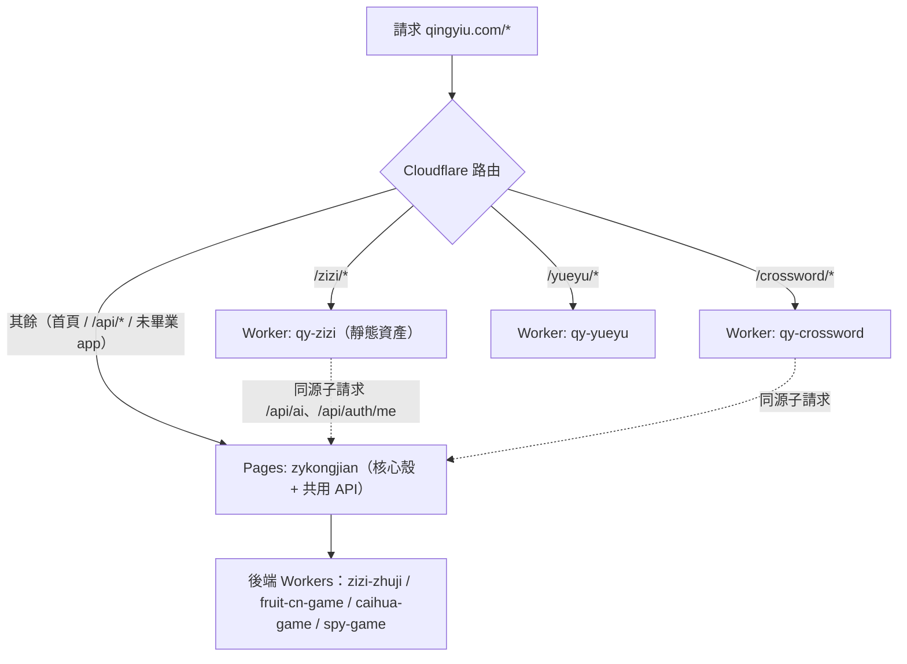

# 清沂遊 · 漸進式獨立 Worker 部署架構

> 本文是把 `B3_GRADUATION_SOP.md`（taixu.app 那套）改寫成**適合本專案（qingyiu.com / project `zykongjian`）**的版本。
> 目標：保留 monorepo 的開發優點，但部署上做到「**改哪個 app 就只部署哪個 app**」，不再全量建構。

---

## 為什麼要做

- 平台跨語言、跨地區，內容會越來越多；Cloudflare 也在主推 **Workers**（而非 Pages）。
- 現況是**單一 Pages 全量建構**：`npm run build`（[scripts/build.mjs](../scripts/build.mjs)）依序 `npm install` + `vite build` 所有 Vue app，再整包 `wrangler pages deploy`。app 一多就：
  1. 建構慢（每次都全量）；
  2. 一個 app 壞掉會**連帶整站部署失敗**。
- 目標終局：每個前端 app 是自己的 Worker，掛在 `qingyiu.com/<prefix>/*`；推送只觸發該 app 的建構部署，互不拖累。

---

## 核心架構（同網域、多 Worker、Route 分流）

對外仍是單一網域 `qingyiu.com`。靠 **Worker Routes** 把不同路徑前綴分流到不同 Worker：



關鍵點：
- **Worker Route 優先於 Pages**。畢業 app 的 `qingyiu.com/<prefix>/*` 由它自己的 Worker 接管；其餘（首頁、`/api/*`、尚未畢業的 app）仍落到 Pages 核心。
- app 內所有 `fetch('/api/...')` 是**同源子請求**，路徑不在自己的 `<prefix>/` 底下，會自動落到 Pages 核心 → 共用 `functions/`（auth / ai / image / sessions / cantonese）。**畢業 app 不需自帶認證/AI 邏輯。**

---

## app 審計與分類（逐一檢查結果）

### A. 前端 Vue app —— 建構成本高，**優先畢業**

| app | 前綴 prefix | 後端依賴 | 既有後端 Worker | 備註 |
|---|---|---|---|---|
| 字字珠璣 | `/zizi/` | `VITE_ZIZI_API` → zizi-zhuji | ✅ zizi-zhuji | **首個試點**，垂直切片最乾淨 |
| 手勢切水果學中文 | `/手勢切水果學中文/` | `VITE_API_BASE` → fruit-cn-game、`/api/tts`、`/ws` | ✅ fruit-cn-game | 前綴含中文，建議日後改 ASCII |
| 中文填字接龍 | `/crossword/` | `/api/ai/deepseek`、`/api/sessions/*`、`/api/classes/*`、google auth | （共用 functions） | 依賴共用 API |
| yueyu-learn/web | `/yueyu/` | `/api/cantonese/*` | （共用 functions） | 子目錄 app（web/） |
| 班級守護隊 | `/班級守護隊/` | `/api/sessions/*` 等 | （共用 functions） | 前綴含中文 |
| 句子排序小火車 | `/句子排序小火車/` | 無（純前端） | — | 前綴含中文 |
| ancient-astronomy | 待定 | OAuth portal、forge API | — | 目前**未納入 build.mjs**，新開發中 |

### B. 純靜態 app —— 只是複製，建構成本低，**可暫留 Pages / 日後再畢業**

| app | 前綴 | 後端依賴 |
|---|---|---|
| lingganmofang（靈感魔方） | `/lingganmofang/` | `/api/ai/deepseek`、`/api/image` |
| poetpal（詩友記） | `/poetpal/` | `/api/ai/deepseek` |
| 字詞地鼠戰 | `/字詞地鼠戰/` | `/api/ai/deepseek` |
| 巧手猜猜畫 | `/巧手猜猜畫/` | caihua-game（workers.dev） |
| 誰是臥底 | `/誰是臥底/` | spy-game（workers.dev） |
| luoyang-trip | `/luoyang-trip/` | 純靜態 |
| 手勢點名 | `/手勢點名/` | 純靜態 |
| 春江花月夜 | `/春江花月夜/` | 純靜態 |
| 詞語配配樂 | `/詞語配配樂/` | 純靜態 |
| shijingmofang | `/shijingmofang/` | 純靜態（目前未納入 build.mjs） |

### C. 共用核心（留在 Pages，未來可再畢業成 `qy-core` Worker）

- 首頁 `index.html`、`404.html`、`auth-widget.js`、`_headers`
- `functions/`：`auth/*`、`api/ai/deepseek`、`api/image`、`api/cantonese/*`、`api/sessions/*`、`api/classes/*`、`api/teacher/*`、`api/user`、`_middleware.ts`

### D. 後端 Worker（**已經是獨立 Worker，無需處理**）

`caihua-game`、`fruit-cn-game`、`spy-game`、`zizi-zhuji`（皆 Durable Objects 房間制）。

---

## 推進策略（不大爆改，逐個垂直切片）

1. **先畢業 7 個 Vue app**（建構成本最高，收益最大），一次一個，驗證通過再下一個。
2. **純靜態 app 暫留 Pages**（複製成本低，且多含中文前綴，Route 較麻煩）；待有需要或統一改 ASCII 前綴後再畢業。
3. **共用 `/api/*` 與首頁暫留 Pages 核心**；待 Vue app 全部畢業、Pages 只剩殼與 API 時，再評估把核心也搬成 Worker，徹底脫離 Pages。

> 不做「過渡期雙重建構」：一個 app 畢業並切好生產 Route 後，**同一次提交**就從 `scripts/build.mjs` 移除它，持續縮短全量建構時間。

---

## 單一 app 畢業步驟（標準流程）

以 `<APP>` = app 目錄、`<prefix>` = 路徑前綴 為例。

### 1. 建立 worker 設定（手寫，不用產生器）
在 `apps/<APP>/` 放：
- `wrangler.jsonc`：`name` = `qy-<prefix>`、配置 Workers Assets（`directory: .worker-dist`、`not_found_handling: single-page-application`）。先**不寫 `routes`**。
- `.npmrc`：`include=dev`（Workers Builds 環境 `NODE_ENV=production`，否則 `vite`/`vue-tsc` 被略過）。
- `package.json`：加 `build:worker`（呼叫共用 [scripts/build-app-worker.mjs](../scripts/build-app-worker.mjs)）與 `deploy`，devDep 加 `wrangler`。

### 2. 本地建構驗證
```bash
npm --prefix apps/<APP> install
npm --prefix apps/<APP> run build:worker   # 產物在 apps/<APP>/.worker-dist/
```
確認佈局：`.worker-dist/<prefix>/{index.html,assets/...}` + 根 `.worker-dist/index.html`（SPA 深連結回退）。

### 3. 隔離部署（先不接生產 route）
```bash
npx wrangler deploy --config apps/<APP>/wrangler.jsonc
```
在 `qy-<prefix>.<account>.workers.dev` 驗證：首頁、深連結、靜態資產、後端 API、同源 `/api` 子請求。

### 4. ⛔ 停下等用戶：dashboard Connect Git（GitHub OAuth 無法 API 自動化）
Dashboard → Workers & Pages → `qy-<prefix>` → Settings → Build → Connect：

| 欄位 | 值 |
|---|---|
| Build command | `npm install && npm run build:worker` |
| Deploy command | `npx wrangler deploy` |
| Root directory | `/apps/<APP>` |
| Build watch paths | `apps/<APP>/*` |

> Build watch paths 是關鍵：只有該 app 目錄變動才觸發這個 worker 的建構，互不拖累。

### 5. 切生產 route
在 `apps/<APP>/wrangler.jsonc` 加：
```jsonc
"routes": [{ "pattern": "qingyiu.com/<prefix>/*", "zone_name": "qingyiu.com" }]
```
重新 `npx wrangler deploy --config apps/<APP>/wrangler.jsonc`，於 `qingyiu.com/<prefix>/` 再驗一次。

### 6. 從全量建構移除（同一次提交）
- 從 [scripts/build.mjs](../scripts/build.mjs) 移除該 app 的 `buildVueApp(...)`／靜態複製項。
- 更新本文件分類表，把該 app 標為「已畢業」。

---

## 鐵則（沿用 B3 經驗）

- **不在畢業 worker 內重造 auth/AI/image**：沿用同源子請求 `/api/auth/me`、`/api/ai/deepseek`、`/api/image`。
- **lockfile 必須入庫**：Workers Builds 用 `npm ci`，缺 `package-lock.json` 會 EUSAGE 失敗。每個畢業 app 的 Root directory 下要有自己的 `package-lock.json` 並提交。
- **devDependencies 必須裝入**：靠 `apps/<APP>/.npmrc` 的 `include=dev`，否則 CI 找不到 `vite`/`vue-tsc`。
- **secrets 不進 wrangler.jsonc**：`wrangler secret put <NAME> --name qy-<prefix>`。
- **只做部署拓撲遷移**，不順手改 app 顯示/業務邏輯。
- **中文前綴**（如 `班級守護隊`）Route pattern 可用但易踩編碼坑；建議畢業時順勢評估改 ASCII 前綴（需同步改首頁連結與 `VITE_BASE_PATH`）。
